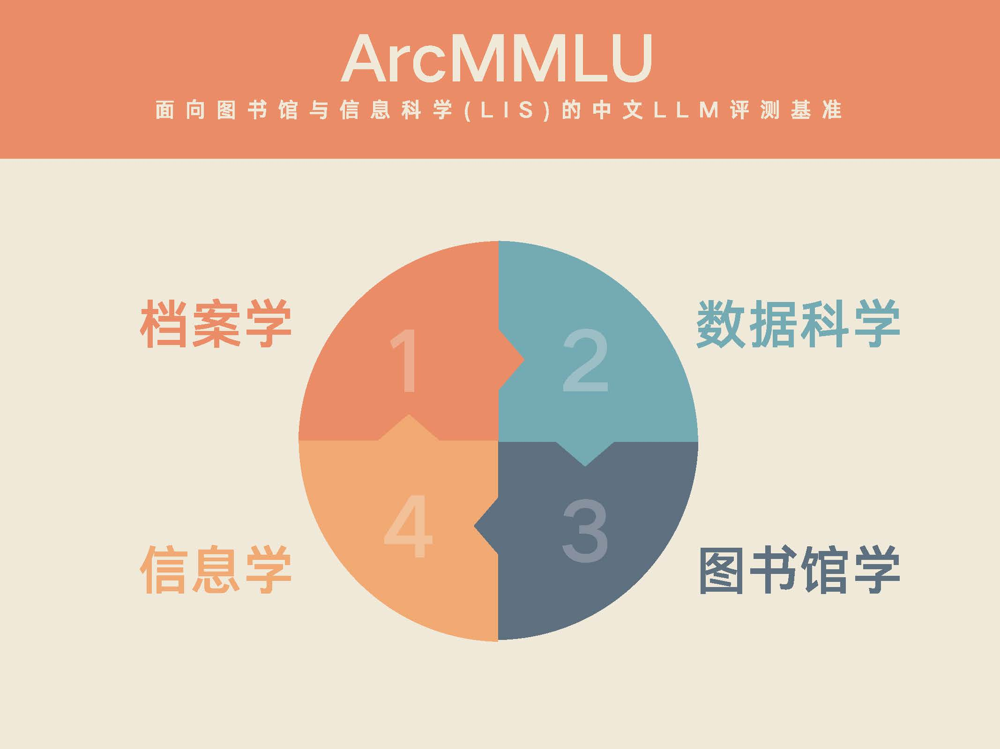

# ArcMMLU—面向图书馆与信息科学(LIS)的中文大语言模型评测基准


<p align="center">        </p>

<h4 align="center">
    <p>
        <b>简体中文</b> |
        <a href="https://github.com/stzhang-patrick/ArcMMLU/blob/main/README_EN.md">English</a> 
    <p>
</h4>

<p align="center" style="display: flex; flex-direction: row; justify-content: center; align-items: center">
📄 <a href="#" target="_blank" style="margin-right: 15px; margin-left: 10px">论文</a> • 
🏆 <a href="#" target="_blank"  style="margin-left: 10px">排行榜</a> •
🤗 <a href="#" target="_blank" style="margin-left: 10px">数据集</a> 
</p>


## 简介

ArcMMLU是一个专为图书馆与信息科学（Library & Information Science, LIS）打造的中文大语言模型评测基准，旨在评估大语言模型在LIS学科领域的知识掌握和推理能力，其中涵盖了档案学、数据科学、图书馆学和信息学等四个关键细分领域。

需要特别说明的是，ArcMMLU的命名来源于我们之前的大语言模型研究项目——ArcGPT，这一项目主要针对档案学。随后，我们的研究视野从档案学拓展至更广泛的信息管理领域，但我们仍然保留了ArcMMLU这一称谓。因此，ArcMMLU不仅仅是档案学的评测基准，它是面向整个LIS学科的综合评测工具。

出于通用性、便捷性的考虑，ArcMMLU选择了与CMMLU一致的数据格式。同时，基于CMMLU项目，我们提供了匹配的评测代码。对已在CMMLU上评测过的模型，进行ArcMMLU的评测将会变得格外简便。特别感谢[CMMLU---中文多任务语言理解评估](https://github.com/haonan-li/CMMLU)项目为中文大型语言模型评测所作出的贡献。我们希望ArcMMLU能作为其在细分领域的有力补充，为中文大语言模型评测带来更多的细节与深度。

<p align="center">        </p>

## 排行榜（未排序）

以下表格显示了模型在 five-shot 和 zero-shot 下的表现。如果您想贡献您的模型结果，请与我们联系或直接提交拉取请求。

### Five-shot

| 模型         | 档案学 | 数据科学 | 图书馆学 | 信息学 | 平均分 |
| ------------ | ------ | -------- | -------- | ------ | ------ |
| ChatGLM2-6B  | 52.73  | 54.10    | 51.85    | 48.63  | 51.83  |
| BATGPT-15B   | 44.15  | 49.57    | 45.94    | 43.53  | 45.80  |
| XVERSE-13B   | 60.28  | 63.18    | 65.41    | 60.32  | 62.30  |
| InternLM-7B  | 51.33  | 61.11    | 60.33    | 51.24  | 56.00  |
| Baichuan-7B  | 50.70  | 50.63    | 52.63    | 46.64  | 50.15  |
| Baichuan-13B | 56.12  | 61.24    | 62.19    | 59.33  | 59.72  |

### Zero-shot

| 模型         | 档案学 | 数据科学 | 图书馆学 | 信息学 | 平均分 |
| ------------ | ------ | -------- | -------- | ------ | ------ |
| ChatGLM2-6B  | 52.19  | 56.70    | 53.82    | 48.88  | 52.90  |
| BATGPT-15B   | 48.31  | 54.30    | 53.35    | 45.27  | 50.31  |
| XVERSE-13B   | 53.68  | 55.64    | 58.84    | 56.34  | 56.13  |
| InternLM-7B  | 52.96  | 59.91    | 59.62    | 51.24  | 55.95  |
| Baichuan-7B  | 49.21  | 46.36    | 48.69    | 45.27  | 47.38  |
| Baichuan-13B | 54.41  | 57.17    | 61.05    | 54.48  | 56.78  |

## 数据示例

数据集内的每个问题均为四选一的选择题，其中仅有一个选项为正确答案。数据采用逗号分隔，并保存为.csv文件格式。以下是数据样例：

```bash
# 档案学
问题: 档案与图书、文献资料相比，其特有属性是( )。
A.原始记录性
B.知识性
C.信息性
D.服务型
答案: A

# 数据科学
问题: 在下列哪种情况下，我们通常使用回归分析？( )
A.当我们想预测一个连续的变量，例如人的身高。
B.当我们想预测一个离散的变量，例如人的婚姻状态。
C.当我们想预测一个分类变量，例如人的性别。
D.当我们有一组变量，并且想找出它们之间的关系。
答案: A

# 图书馆学
问题: 《中图法》中基本大类由22个字母表示，“E”和“O”分别表示的是( )。
A.军事，数理科学和化学
B.文学，环境科学
C.语言文学、天文学
D.经济，法律
答案: A

# 信息学
问题: 在信息分布的规律和特征中，揭示论文在科学期刊中的分布规律的定律是( )。
A.马太效应
B.布拉德福定律
C.齐夫定律
D.洛特卡定律
答案: B
```

## 使用方法

要在您的项目中使用我们的代码，请将存储库克隆到本地计算机：

```bash
git clone https://github.com/stzhang-patrick/ArcMMLU.git
cd ArcMMLU/src
```

## 数据

我们根据每个评测维度在data/dev和data/test目录中提供了开发和测试数据集。

