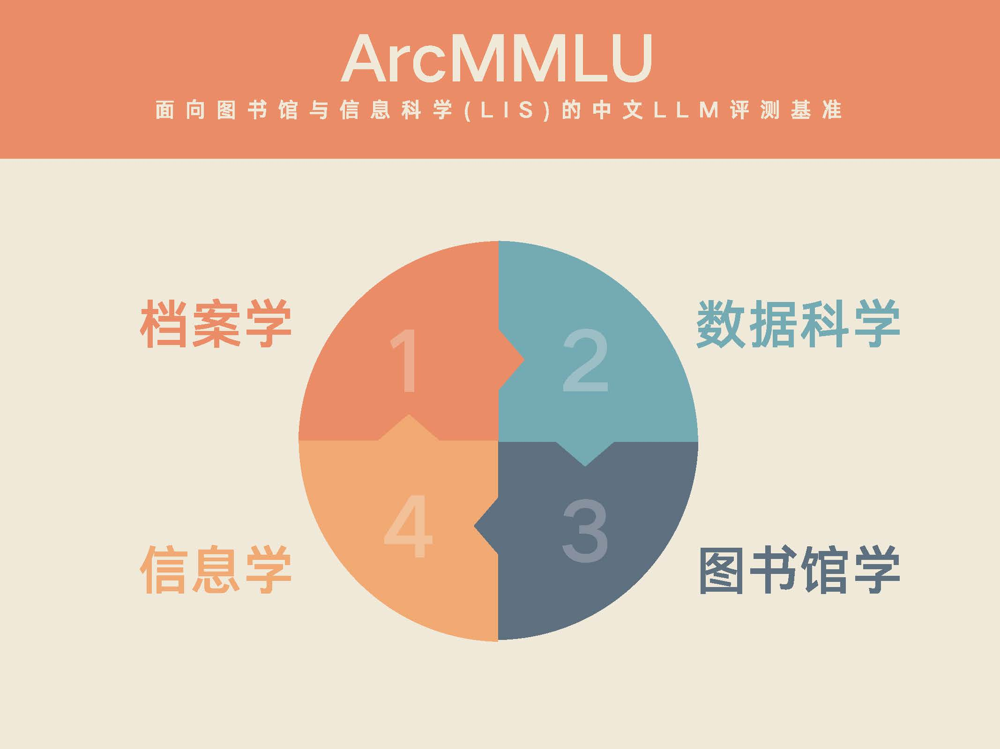

# ArcMMLU—Evaluating LLMs in Library and Information Science (LIS)

<p align="center">        </p>

<h4 align="center">
    <p>
        <a href="https://github.com/stzhang-patrick/ArcMMLU/blob/main/README.md">Simplified Chinese</a> |
        <b>English</b>
    <p>
</h4>

<p align="center" style="display: flex; flex-direction: row; justify-content: center; align-items: center">
📄 <a href="#" target="_blank" style="margin-right: 15px; margin-left: 10px">Paper</a> •
🏆 <a href="#" target="_blank"  style="margin-left: 10px">Leaderboard</a> • 
🤗 <a href="#" target="_blank" style="margin-left: 10px">Dataset</a>
</p>

## Introduction

ArcMMLU is a Chinese benchmark specifically designed for evaluating LLMs on Library & Information Science (LIS). It aims to evaluate the knowledge and reasoning capabilities of LLMs in the LIS academic field, which covers four key sub-areas: Archival Science, Data Science, Library Science, and Information Science.

It is important to note that the name ArcMMLU is derived from our previous large language model research project—[ArcGPT](https://arxiv.org/abs/2307.14852), which was primarily focused on Archival Science. Later, our research scope expanded from Archival Science to a broader field of information management, but we retained the name ArcMMLU. Therefore, ArcMMLU is not just an evaluation benchmark for Archival Science; it is a comprehensive evaluation dataset for the entire LIS discipline.

For the sake of convenience, ArcMMLU adopts the same data format as CMMLU. Furthermore, based on the CMMLU project, we provide evaluation code. For models that have been evaluated on CMMLU, conducting an evaluation on ArcMMLU will be pretty straightforward. Special thanks to the [CMMLU---Chinese Multi-Task Language Understanding Evaluation](https://github.com/haonan-li/CMMLU) project for its contribution to the evaluation of Chinese LLMs. We hope that ArcMMLU can serve as a powerful supplement in specialized fields, bringing more detail and depth to the evaluation of Chinese LLMs.

<p align="center">        </p>

## Leaderboard

The following table displays the performance of models in the zero-shot and five-shot setting. If you wish to contribute your model's results, kindly contact us or submit a pull request to update this section. 


### Zero-shot


| Model                                                                         | archive | data science | library | information | avg |
|-------------------------------------------------------------------------------|-------|---------|---------|-------|-------|
| GPT4 (gpt-4-0613)                                                             | 66.38 | 82.12 | 66.79 | 78.55 | 73.46 |
| [Qwen-14B](https://github.com/QwenLM/Qwen)                                    | 66.65 | 71.51 | 63.06 | 71.21 | 68.11 |
| [Baichuan2-13B](https://github.com/baichuan-inc/Baichuan2)                    | 61.59 | 65.58 | 61.57 | 66.49 | 63.81 |
| [XVERSE-7B](https://github.com/xverse-ai/XVERSE-7B)                           | 61.82 | 65.64 | 59.58 | 66.67 | 63.43 |
| [Qwen-7B](https://github.com/QwenLM/Qwen)                                     | 59.78 | 64.31 | 56.47 | 63.68 | 61.06 |
| ChatGPT (gpt-3.5-turbo)                                                       | 52.37 | 65.64 | 52.61 | 66.19 | 59.20 |
| [InternLM-20B](https://github.com/InternLM/InternLM)                          | 53.82 | 61.37 | 55.72 | 63.14 | 58.51 |
| [Baichuan2-7B](https://github.com/baichuan-inc/Baichuan2)                     | 56.08 | 61.11 | 55.72 | 61.11 | 58.50 |
| [Baichuan-13B](https://github.com/baichuan-inc/Baichuan-13B)                  | 54.41 | 57.17 | 54.48 | 61.05 | 56.78 |
| [XVERSE-13B](https://github.com/xverse-ai/XVERSE-13B)                         | 53.37 | 56.70 | 57.21 | 59.62 | 56.73 |
| [InternLM-7B](https://github.com/InternLM/InternLM)                           | 51.88 | 59.97 | 51.37 | 61.29 | 56.13 |
| [ChatGLM2-6B](https://github.com/THUDM/ChatGLM2-6B)                           | 52.06 | 56.97 | 49.00 | 53.70 | 52.93 |
| [educhat-base-002-13b](https://github.com/icalk-nlp/EduChat)                  | 47.85 | 52.84 | 48.01 | 57.47 | 51.54 |
| [Baichuan-7B](https://github.com/baichuan-inc/Baichuan-7B)                    | 49.21 | 46.36 | 45.27 | 48.69 | 47.38 |
| [ChatGLM-6B](https://github.com/THUDM/ChatGLM-6B)                             | 43.06 | 46.96 | 38.81 | 47.91 | 44.19 |
| [Ziya-LLaMA-13B-v1.1](https://huggingface.co/IDEA-CCNL/Ziya-LLaMA-13B-v1.1)   | 37.32 | 41.69 | 40.05 | 47.43 | 41.63 |


### Five-shot

| Model                                                                         | archive | data science | library | information | avg |
|-------------------------------------------------------------------------------|-------|---------|---------|-------|-------|
| GPT4 (gpt-4-0613)                                                             | 68.41 | 81.99 | 70.40 | 79.51 | 75.08 |
| [Qwen-14B](https://github.com/QwenLM/Qwen)                                    | 67.24 | 72.85 | 64.80 | 71.39 | 69.07 |
| [Baichuan2-13B](https://github.com/baichuan-inc/Baichuan2)                    | 62.00 | 66.91 | 61.44 | 66.07 | 64.11 |
| [XVERSE-7B](https://github.com/xverse-ai/XVERSE-7B)                           | 61.91 | 63.44 | 61.69 | 65.77 | 63.20 |
| [XVERSE-13B](https://github.com/xverse-ai/XVERSE-13B)                         | 60.33 | 62.98 | 60.20 | 65.53 | 62.26 |
| [Qwen-7B](https://github.com/QwenLM/Qwen)                                     | 58.74 | 65.31 | 59.20 | 64.70 | 61.99 |
| [Baichuan2-7B](https://github.com/baichuan-inc/Baichuan2)                     | 59.56 | 63.51 | 59.95 | 63.26 | 61.57 |
| ChatGPT (gpt-3.5-turbo)                                                       | 53.95 | 68.18 | 53.86 | 66.31 | 60.57 |
| [Baichuan-13B](https://github.com/baichuan-inc/Baichuan-13B)                  | 56.12 | 61.24 | 59.33 | 62.19 | 59.72 |
| [InternLM-20B](https://github.com/InternLM/InternLM)                          | 54.77 | 61.04 | 56.84 | 61.77 | 58.60 |
| [InternLM-7B](https://github.com/InternLM/InternLM)                           | 50.75 | 59.24 | 50.50 | 59.44 | 54.98 |
| [ChatGLM2-6B](https://github.com/THUDM/ChatGLM2-6B)                           | 52.78 | 53.97 | 48.76 | 51.85 | 51.84 |
| [Baichuan-7B](https://github.com/baichuan-inc/Baichuan-7B)                    | 50.70 | 50.63 | 46.64 | 52.63 | 50.15 |
| [ChatGLM-6B](https://github.com/THUDM/ChatGLM-6B)                             | 39.99 | 40.23 | 36.57 | 41.88 | 39.67 |

## Data Format
Each question in the dataset is a multiple-choice questions with 4 choices and only one choice as the correct answer.  The data is comma saperated .csv file.

Here are some examples:
```bash
# archive
问题: 档案与图书、文献资料相比，其特有属性是( )。
A.原始记录性
B.知识性
C.信息性
D.服务型
答案: A

# data science
问题: 在下列哪种情况下，我们通常使用回归分析？( )
A.当我们想预测一个连续的变量，例如人的身高。
B.当我们想预测一个离散的变量，例如人的婚姻状态。
C.当我们想预测一个分类变量，例如人的性别。
D.当我们有一组变量，并且想找出它们之间的关系。
答案: A

# library
问题: 《中图法》中基本大类由22个字母表示，“E”和“O”分别表示的是( )。
A.军事，数理科学和化学
B.文学，环境科学
C.语言文学、天文学
D.经济，法律
答案: A

# information
问题: 在信息分布的规律和特征中，揭示论文在科学期刊中的分布规律的定律是( )。
A.马太效应
B.布拉德福定律
C.齐夫定律
D.洛特卡定律
答案: B
```

## Usage

To use our code in your project, clone the repository to your local machine:

```bash
git clone https://github.com/stzhang-patrick/ArcMMLU.git
cd ArcMMLU/src
```

## Data

We provide development and test dataset according to each subject in the [arcmmlu_data/dev](arcmmlu_data/dev) and [arcmmlu_data/test](arcmmlu_data/test) directory.


## Citation
```
@misc{zhang2023arcgpt,
    title={ArcGPT: A Large Language Model Tailored for Real-world Archival Applications}, 
    author={Shitou Zhang and Jingrui Hou and Siyuan Peng and Zuchao Li and Qibiao Hu and Ping Wang},
    year={2023},
    eprint={2307.14852},
    archivePrefix={arXiv},
    primaryClass={cs.CL}
}
```

## License

The ArcMMLU dataset is licensed under a
[Creative Commons Attribution-NonCommercial-ShareAlike 4.0 International License](http://creativecommons.org/licenses/by-nc-sa/4.0/).